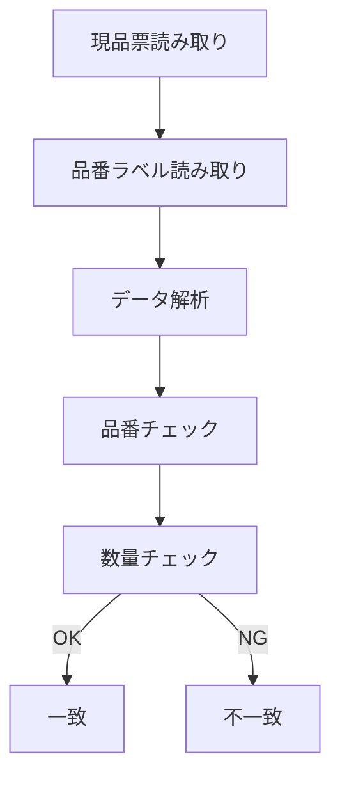

# Code39 Checker

### 現品票・品番ラベル突合アプリ（物流DXツール）

物流現場で使用される\
**現品票バーコード（Code39）と品番ラベルの突合チェック**\
を行うための軽量PWAアプリです。

スマートフォン + バーコードスキャナで\
**瞬時に品番・数量の一致確認**を行うことができます。

------------------------------------------------------------------------

# 背景

物流現場では次のような問題が頻繁に発生します。

-   現品票とラベルの品番違い
-   数量入力ミス
-   人手による確認ミス
-   検品作業の時間増加

本ツールはこれらを解決するために開発しました。

✔ 検品作業の自動化\
✔ ヒューマンエラー削減\
✔ スマートフォンのみで運用可能

------------------------------------------------------------------------

# デモ

GitHub Pages

https://xxxxx.github.io/code39-checker

スマートフォンで開くと\
**アプリとしてインストール可能です。**

------------------------------------------------------------------------

# システム構成

------------------------------------------------------------------------

# 処理フロー

------------------------------------------------------------------------

# 主な機能

### バーコード読み取り

Code39形式

例

ABC123 10

解析結果

品番: ABC123\
数量: 10

------------------------------------------------------------------------

### 自動突合

チェック内容

-   品番一致
-   数量一致

結果

  結果     表示
  -------- ------
  一致     OK
  不一致   NG

------------------------------------------------------------------------

### PWA対応

スマートフォンで

-   アプリのように起動
-   オフライン使用
-   高速動作

------------------------------------------------------------------------

# 使用方法

## 1 アプリを開く

https://xxxxx.github.io/code39-checker

------------------------------------------------------------------------

## 2 現品票を読み取る

バーコードスキャナで現品票を読み取ります。

------------------------------------------------------------------------

## 3 品番ラベルを読み取る

続けてラベルを読み取ります。

------------------------------------------------------------------------

## 4 結果確認

画面に

一致\
または\
不一致

が表示されます。

------------------------------------------------------------------------

# スマホアプリとして使用

## iPhone

Safari\
↓\
共有ボタン\
↓\
ホーム画面に追加

------------------------------------------------------------------------

## Android

Chrome\
↓\
アプリをインストール

------------------------------------------------------------------------

# 技術スタック

  技術             用途
  ---------------- ------------
  HTML             UI
  JavaScript       ロジック
  PWA              アプリ化
  Service Worker   キャッシュ
  GitHub Pages     公開

------------------------------------------------------------------------

# ディレクトリ構成

code39-checker ├ index.html ├ manifest.json ├ service-worker.js ├
icon-512.png └ docs ├ screen1.png └ screen2.png

------------------------------------------------------------------------

# キャッシュ仕様

Service Workerにより以下をキャッシュ

-   index.html
-   manifest.json
-   icon
-   service-worker

これにより

-   オフライン使用
-   高速起動

が可能になります。

------------------------------------------------------------------------

# 今後のロードマップ

### v1

-   Code39突合
-   PWA

### v2

-   CSVログ保存
-   突合履歴

### v3

-   DB連携
-   出荷管理

### v4

-   WMS連携
-   QRコード管理

------------------------------------------------------------------------

# 想定用途

物流現場

-   出荷検品
-   現品票チェック
-   品番確認

------------------------------------------------------------------------

# ライセンス

MIT License
